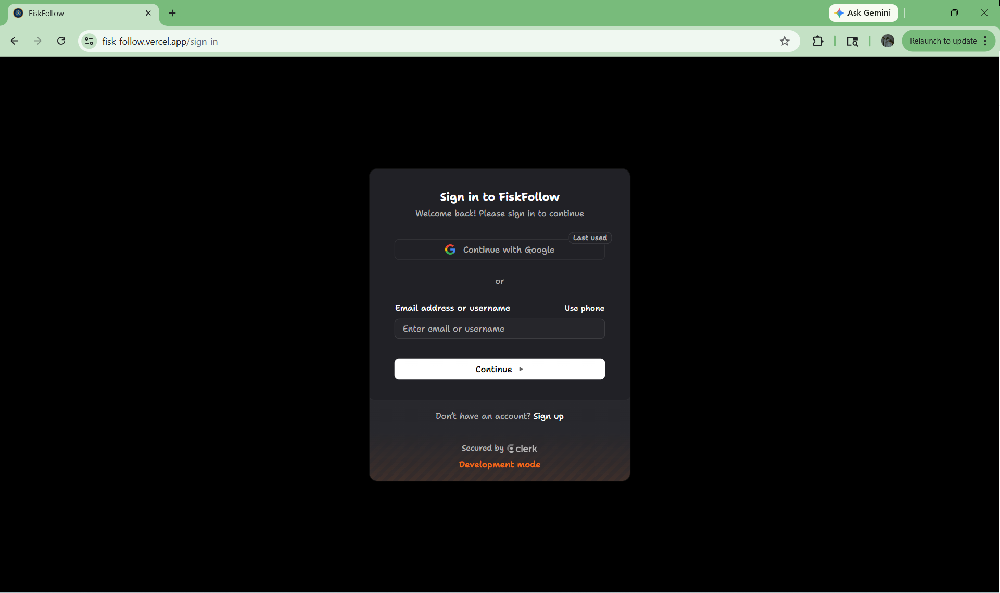
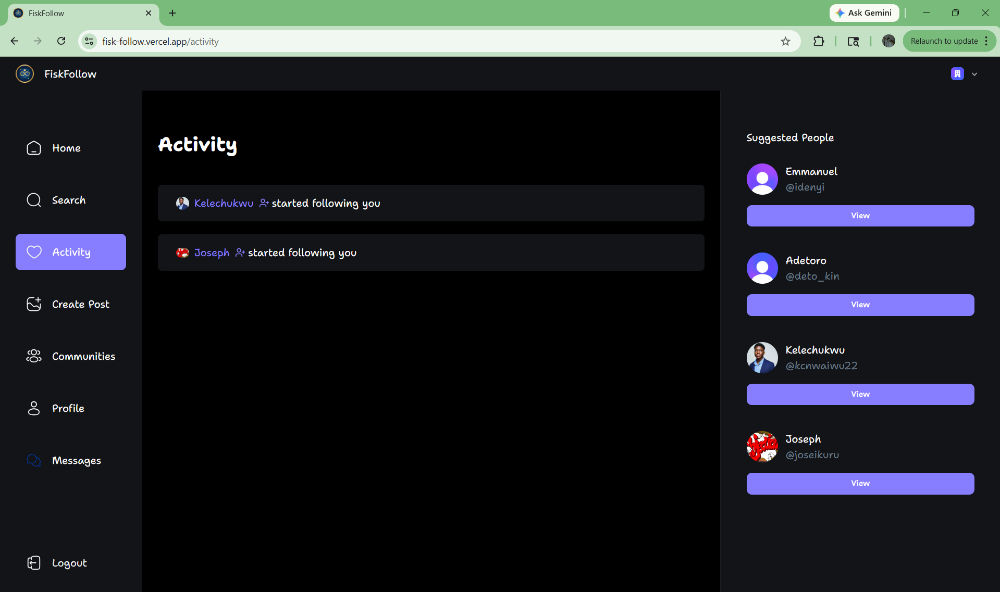
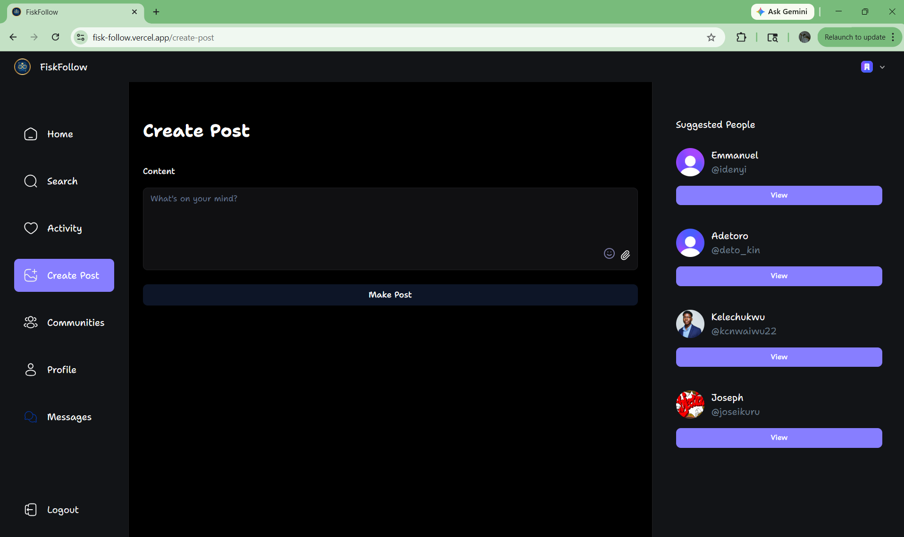
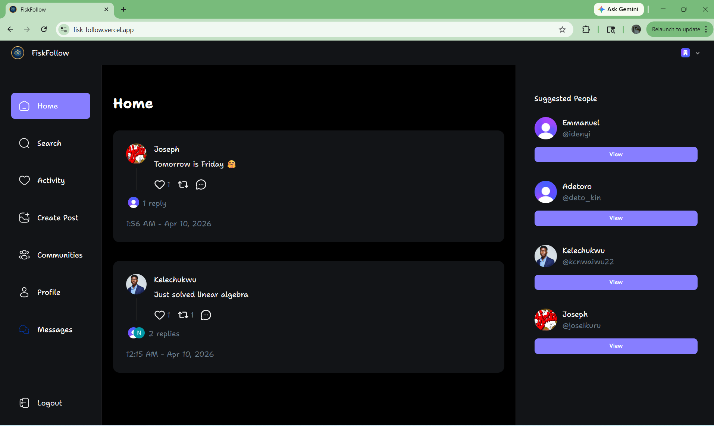
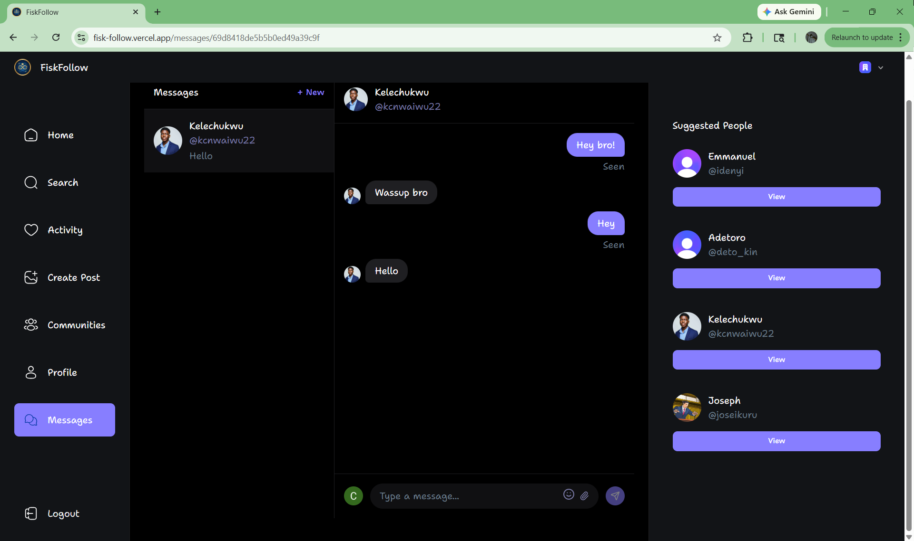
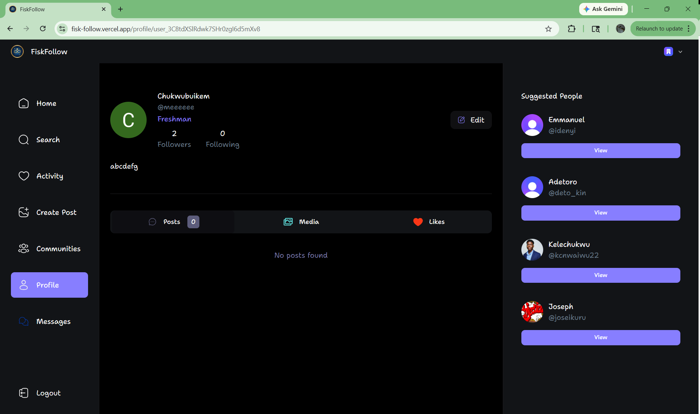
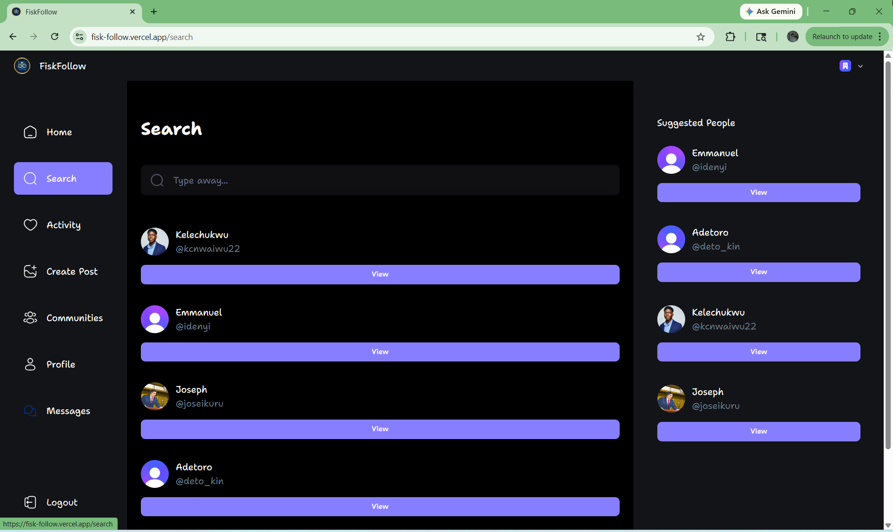

# FiskFollow

**FiskFollow** is a real-time social media web application built exclusively for the Fisk University community. Inspired by platforms like X (Twitter) and Threads, it provides a dedicated, centralized space where Fisk students can share posts, connect with peers, send messages, and stay informed about campus life.

🌐 **Live Application**: [https://fisk-follow.vercel.app](https://fisk-follow.vercel.app)

---

## Project Description

Fisk students currently rely on a fragmented mix of tools — GroupMe, email, Instagram — none of which were designed with campus community in mind. FiskFollow solves this by providing a single, exclusive platform where students can:

- Share posts with text and images
- Like, repost, and comment on content
- Follow peers and discover new connections
- Send real-time direct messages and group chats
- Receive live activity notifications
- Engage with campus organizations through Communities

---

## Core Features

- **User Authentication** — Secure sign-up and sign-in via Clerk (email/password and Google OAuth)
- **Onboarding** — New users set their name, username, bio, profile photo, and year classification
- **Posts** — Create, like, repost, and delete posts with up to 4 image attachments
- **Comments** — Threaded replies with image support and emoji picker
- **Real-Time Messaging** — 1-on-1 DMs and group chats with typing indicators and read receipts (powered by Socket.io)
- **Follow System** — Follow/unfollow users with real-time follower count updates
- **Activity Page** — Live feed of likes, reposts, replies, and new followers
- **User Profiles** — Posts, Media, and Likes tabs with editable profile info
- **Search** — Real-time search across usernames and names
- **Responsive Design** — Works on desktop, tablet, and mobile

---

## Technologies Used

| Category             | Technology                        |
| -------------------- | --------------------------------- |
| Frontend Framework   | Next.js 16 (App Router, React 19) |
| Styling              | Tailwind CSS v4, shadcn/ui        |
| Authentication       | Clerk                             |
| Database             | MongoDB Atlas with Mongoose       |
| Real-Time            | Socket.io v4                      |
| File Uploads         | UploadThing v7                    |
| Form Validation      | Zod + React Hook Form             |
| Language             | TypeScript                        |
| Frontend Deployment  | Vercel                            |
| Socket.io Deployment | Render                            |

---

## Setup Instructions

### Prerequisites

- **Node.js** v18 or higher
- **MongoDB Atlas** account (or local MongoDB instance)
- **Clerk** account — [clerk.com](https://clerk.com)
- **UploadThing** account — [uploadthing.com](https://uploadthing.com)

### 1. Clone the Repository

```bash
git clone https://github.com/Chukwubuikem-Onwuchuruba/FiskFollow.git
cd FiskFollow
```

### 2. Install Dependencies

```bash
npm install --include=dev
```

### 3. Environment Variables

Create a `.env.local` file in the root directory and add the following:

```env
# Clerk Authentication
NEXT_PUBLIC_CLERK_PUBLISHABLE_KEY=
CLERK_SECRET_KEY=
CLERK_WEBHOOK_SECRET=
NEXT_PUBLIC_CLERK_SIGN_UP_URL=/sign-up
NEXT_PUBLIC_CLERK_SIGN_IN_URL=/sign-in
NEXT_PUBLIC_CLERK_AFTER_SIGN_IN_URL=/onboarding
NEXT_PUBLIC_CLERK_SIGN_UP_FALLBACK_REDIRECT_URL=/
NEXT_PUBLIC_CLERK_SIGN_IN_FALLBACK_REDIRECT_URL=/
NEXT_PUBLIC_CLERK_AFTER_SIGN_OUT_URL=/

# MongoDB
MONGODB_URL=

# UploadThing (v7 — single token, get from uploadthing.com dashboard)
UPLOADTHING_TOKEN=

# Socket.io (leave as default for local development)
NEXT_PUBLIC_SOCKET_URL=http://localhost:3001

# App URL (used by Socket.io server for CORS)
FRONTEND_URL=http://localhost:3000
```

---

## How to Run the Project

### Development

A single command starts both the Next.js frontend (port 3000) and the Socket.io real-time server (port 3001) concurrently:

```bash
npm run dev
```

Then open [http://localhost:3000](http://localhost:3000) in your browser.

> **Note:** Two processes run simultaneously — Next.js on port 3000 and Socket.io on port 3001. Both must be running for real-time features (messaging, live counts, notifications) to work.

### Production Build

```bash
npm run build
npm run start
```

The Socket.io server must be started separately in production:

```bash
npm run start:socket
```

---

## Deployment

The application is deployed across two platforms:

- **Next.js (Frontend + Server Actions)** → [Vercel](https://vercel.com)
- **Socket.io (Real-Time Server)** → [Render](https://render.com)

### Deploying to Vercel

1. Push your code to GitHub
2. Import the repository on [vercel.com](https://vercel.com)
3. Add all environment variables from `.env.local` in the Vercel dashboard, updating `NEXT_PUBLIC_SOCKET_URL` to your Render URL
4. Deploy — Vercel auto-detects Next.js and handles the build

### Deploying the Socket.io Server to Render

1. Create a new **Web Service** on [render.com](https://render.com)
2. Connect your GitHub repository
3. Set **Build Command**: `npm install --include=dev`
4. Set **Start Command**: `npm run start:socket`
5. Add environment variables: `FRONTEND_URL` (your Vercel URL) and `NODE_ENV=production`
6. Deploy and copy the generated URL into `NEXT_PUBLIC_SOCKET_URL` on Vercel

---

## Example Usage

### Creating an Account

1. Visit [https://fisk-follow.vercel.app](https://fisk-follow.vercel.app)
2. Click **Sign Up** and register with your email or Google account
3. Complete the onboarding form (name, username, bio, photo, year classification)
4. You will be redirected to the home feed

### Making a Post

1. Click **Create Post** in the sidebar
2. Type your content — use the 😊 emoji button or 📎 paperclip to add images
3. Click **Make Post**

### Messaging

1. Click **Messages** in the sidebar
2. Click **+ New** to start a DM or group chat
3. Search for users, select them, and click **Start Chat**

### Following a User

1. Navigate to any user's profile by clicking their name
2. Click **Follow** — the button updates instantly and the follower count reflects the change in real time

---

## Repository Structure

FiskFollow/
├── app/ # Next.js pages and layouts
│ ├── (auth)/ # Sign-in, sign-up, onboarding
│ ├── (root)/ # Main app pages (home, search, profile, messages, etc.)
│ └── api/ # UploadThing route handler and Clerk webhook
├── components/
│ ├── cards/ # PostCard, UserCard, PostActions, PostImages
│ ├── forms/ # MakePost, Comment, AccountProfile, DeletePost
│ ├── messaging/ # ChatWindow, ConversationList, NewConversation
│ └── shared/ # Sidebar, Bottombar, ProfileHeader, tabs, EmojiPicker
├── lib/
│ ├── actions/ # Server actions (post, user, message, follower, community)
│ ├── models/ # Mongoose schemas (User, Post, Conversation, Message, Community)
│ ├── validations/ # Zod schemas
│ └── socket.ts # Client-side Socket.io singleton
├── constants/ # Sidebar links, tab definitions
├── public/ # Static assets and icons
├── server.ts # Standalone Socket.io server (port 3001)
└── tsconfig.server.json # TypeScript config for Socket.io server

---

## Screenshots

### Sign Up & Sign In



### Activity



### Create Post



### Home



### Messages



### Profile



### Search



---

## Author

**Chukwubuikem Onwuchuruba**
Fisk University — CSCI 412: Senior Seminar, 2026
